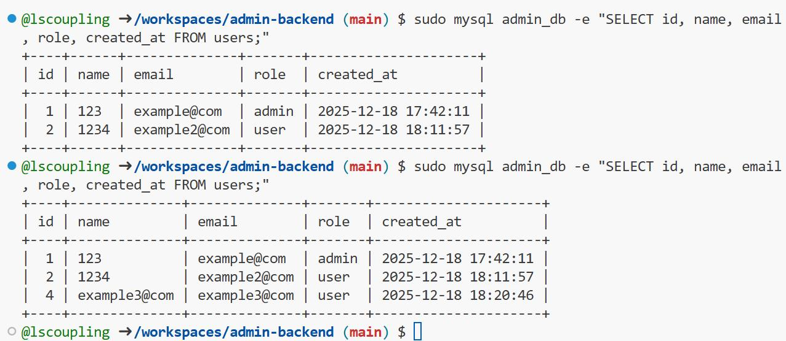
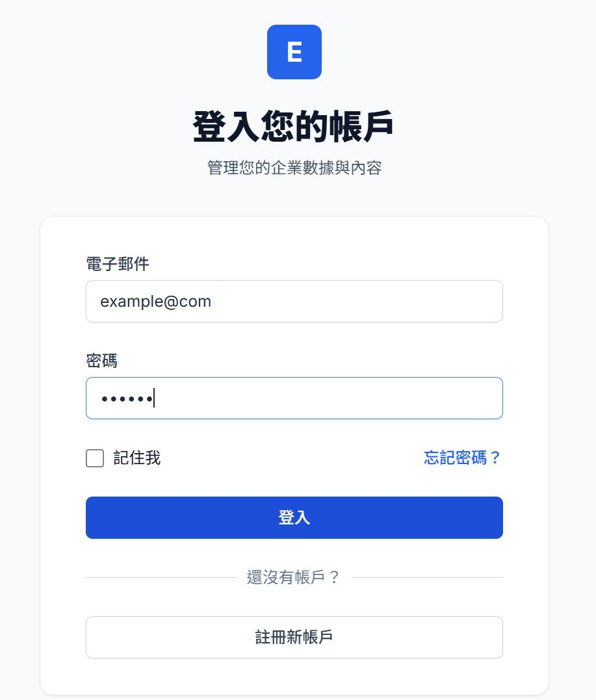
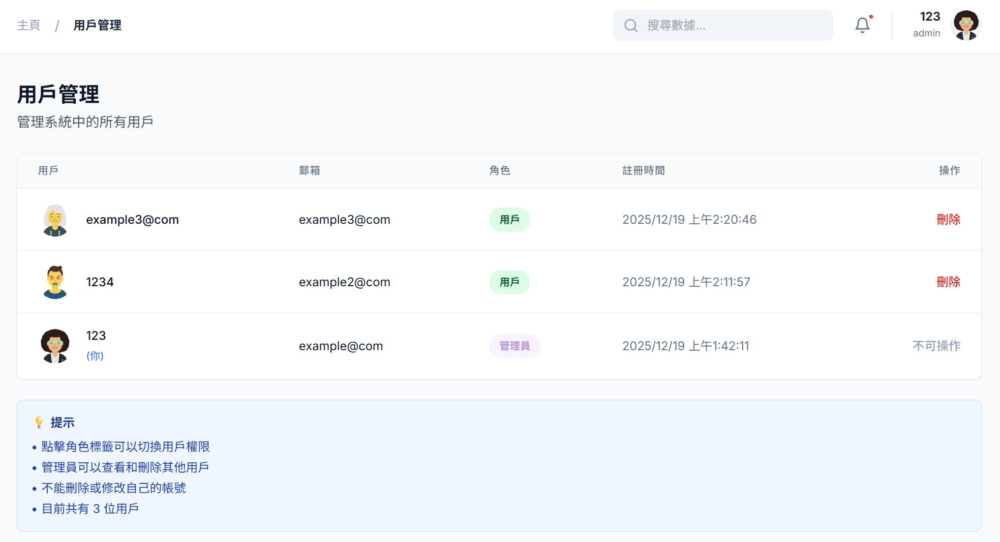

# Admin Backend 系統
 
這是一個**前後端分離**全端管理系統的 Demo 示例，展示用戶認證、角色管理和用戶管理等基本功能。此專案為學習和展示用途，可能存在未完善之處。

## 🎯 項目架構

前後端分離架構：前端 (React/Vite) 運行在端口 3000，後端 (Node.js/Express) 運行在端口 5000，MySQL 數據庫存儲數據。

## 💻 使用技術

### 前端
- **React 19** - UI 框架
- **TypeScript** - 類型安全
- **Vite** - 快速構建工具
- **Tailwind CSS** - 樣式框架（CDN）
- **Recharts** - 圖表庫

### 後端
- **Node.js** - JavaScript 運行環境
- **Express** - Web 框架
- **MySQL** - 關係型數據庫
- **mysql2** - MySQL 驅動
- **JWT (jsonwebtoken)** - 身份驗證
- **bcryptjs** - 密碼加密
- **CORS** - 跨域資源共享

## 📦 搭建過程

### 1. 安裝 MySQL 和創建數據庫

```bash
# 安裝 MySQL
sudo apt-get update
sudo apt-get install -y mysql-server
sudo service mysql start

# 創建數據庫和用戶
sudo mysql -e "CREATE DATABASE IF NOT EXISTS admin_db;"
sudo mysql -e "CREATE USER IF NOT EXISTS 'admin'@'localhost' IDENTIFIED BY 'admin123';"
sudo mysql -e "GRANT ALL PRIVILEGES ON admin_db.* TO 'admin'@'localhost';"
sudo mysql -e "FLUSH PRIVILEGES;"
```

或使用自動化腳本：

```bash
chmod +x setup.sh
./setup.sh
```

### 2. 配置後端環境變數

編輯 `server/.env` 文件：

```env
PORT=5000
DB_HOST=localhost
DB_USER=admin
DB_PASSWORD=admin123
DB_NAME=admin_db
JWT_SECRET=your-secret-key-change-this-in-production
```

### 3. 安裝並啟動後端服務器

```bash
cd server
npm install
npm run dev
```

✅ 後端將運行在 `http://localhost:5000`

### 4. 安裝並啟動前端（新終端）

```bash
# 在項目根目錄
npm install
npm run dev
```

✅ 前端將運行在 `http://localhost:3000`

### 5. 創建管理員帳號

註冊第一個用戶後，將其設為管理員：

```bash
sudo mysql admin_db -e "UPDATE users SET role = 'admin' WHERE id = 1;"
```

或者註冊後，由現有管理員在「用戶管理」頁面中設置。

## 📁 項目結構

```
admin-backend/
├── server/                    # 後端目錄
│   ├── server.js             # Express 服務器主文件
│   ├── db.js                 # MySQL 數據庫連接
│   ├── package.json          # 後端依賴
│   └── .env                  # 後端環境變數
├── components/                # 前端組件
│   ├── LoginPage.tsx         # 登入頁面
│   ├── RegisterPage.tsx      # 註冊頁面
│   ├── Dashboard.tsx         # 管理後台主頁
│   └── UserManagement.tsx    # 用戶管理頁面
├── App.tsx                    # 前端主組件
├── types.ts                   # TypeScript 類型定義
├── constants.tsx              # 常量和圖標
├── vite.config.ts            # Vite 配置（含代理設置）
├── package.json              # 前端依賴
├── index.html                # HTML 入口
└── README.md                 # 本文件
```

## ️ 數據庫結構

### users 表

| 欄位 | 類型 | 說明 | 約束 |
|------|------|------|------|
| id | INT | 用戶 ID | 主鍵、自增 |
| name | VARCHAR(255) | 用戶姓名 | NOT NULL |
| email | VARCHAR(255) | 電子郵件 | UNIQUE、NOT NULL |
| password | VARCHAR(255) | 加密後的密碼 | NOT NULL |
| role | VARCHAR(50) | 用戶角色 | 預設值：'user' |
| avatar | VARCHAR(500) | 頭像 URL | 可為空 |
| created_at | TIMESTAMP | 創建時間 | 自動設置 |
| updated_at | TIMESTAMP | 更新時間 | 自動更新 |

### 查詢數據庫

```bash
# 查看所有用戶
sudo mysql admin_db -e "SELECT id, name, email, role, created_at FROM users;"

# 查看用戶數量
sudo mysql admin_db -e "SELECT COUNT(*) as total FROM users;"

# 設置用戶為管理員
sudo mysql admin_db -e "UPDATE users SET role = 'admin' WHERE email = 'your@email.com';"
```

### 註冊後數據驗證

用戶註冊成功後，資料會立即保存到 MySQL 數據庫中。以下是實際的數據存儲驗證：

#### 1. MySQL 數據庫查詢
通過 MySQL 命令查詢，可以直接看到數據庫中的用戶記錄：



數據包含：
- `id`: 用戶唯一標識（自動遞增）
- `name`: 用戶姓名
- `email`: 電子郵件（唯一索引）
- `role`: 用戶角色（user 或 admin）
- `created_at`: 註冊時間
- `password`: 使用 bcrypt 加密存儲的密碼

#### 2. 用戶註冊流程
前端註冊頁面，用戶填寫註冊資訊：



註冊表單包含：
- 姓名
- 電子郵件
- 密碼（至少 6 個字符）
- 確認密碼

#### 3. 管理後台用戶列表
註冊成功後，管理員可以在後台看到所有用戶：



從圖中可以看到：
- 系統中目前有 3 位用戶
- 顯示每位用戶的姓名、郵箱、角色和註冊時間
- 管理員可以查看所有用戶資料並進行管理（刪除、切換角色）

**重要說明**：
- ✅ 密碼使用 bcrypt 加密存儲，無法被反向解密
- ✅ 每次註冊都會生成新的用戶 ID
- ✅ 郵箱具有唯一性約束，避免重複註冊
- ✅ 時間戳自動記錄註冊時間

這證明了**前後端數據流**的完整性：
```
前端註冊表單 → 後端 API (/api/auth/register) → MySQL 數據庫 → 持久化存儲 → 後台管理界面
```

## � 頁面展示

### 用戶功能
✅ 用戶註冊與登入
✅ JWT 身份驗證
✅ 密碼加密（bcrypt）
✅ 自動生成頭像
✅ 響應式設計

### 管理員功能
✅ 查看所有用戶列表
✅ 刪除用戶（不能刪除自己）
✅ 切換用戶角色（user ↔ admin）
✅ 權限控制（只有 admin 可以管理用戶）

### 技術特性
✅ 前後端完全分離
✅ RESTful API 設計
✅ MySQL 數據庫持久化
✅ 現代化 UI 界面
✅ Vite 代理配置（解決 CORS 問題）

## 🎮 使用說明

### 1. 註冊新用戶

1. 打開瀏覽器訪問 `http://localhost:3000`
2. 點擊「**註冊新帳戶**」按鈕
3. 填寫註冊資訊：
   - 姓名
   - 電子郵件
   - 密碼（至少 6 個字符）
   - 確認密碼
4. 點擊「註冊」按鈕
5. 註冊成功後自動登入到管理後台

### 2. 登入系統

1. 在登入頁面輸入註冊時的郵箱和密碼
2. 點擊「登入」
3. 進入管理後台

### 3. 使用管理員功能

**前提條件**：你的帳號必須是 admin 角色

1. 點擊左側選單的「**用戶管理**」
2. 查看所有註冊用戶列表
3. 管理用戶：
   - **切換角色**：點擊角色標籤（admin/user）可以切換權限
   - **刪除用戶**：點擊「刪除」按鈕，確認後刪除
   - **注意**：不能刪除或修改自己的帳號

### 4. 權限說明

- **普通用戶（user）**：只能查看儀表板
- **管理員（admin）**：可以管理所有用戶

## 🔐 安全性說明

### 前端安全
- ❌ 不在前端存儲敏感信息（除了 token）
- ✅ 使用 localStorage 存儲 JWT token
- ✅ 自動附加 token 到 API 請求
- ✅ token 過期後需要重新登入

### 後端安全
- ✅ 密碼使用 bcrypt 加密（不可逆）
- ✅ JWT token 驗證
- ✅ 角色權限檢查
- ✅ SQL 注入防護（使用參數化查詢）
- ✅ CORS 配置


